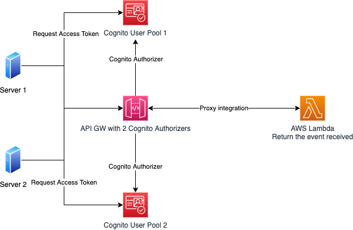

# Cognito Client Grant CDK Stack

## Introduction

This project provides an AWS CDK stack that sets up two Cognito User Pools with client grants and resource servers. It also creates an API Gateway and integrates it with a Lambda function to handle authentication and authorization using the Cognito User Pools.
The purpose of the project is to explain how to set up client credential grants with Cognito User Pools but also how to integrate an API with more than one cognito user pool using multiple authorizers.




## Prerequisites

- AWS CLI installed and configured with appropriate credentials
- Node.js and npm installed
- Python 3.7 or later installed
- AWS CDK installed

## Installation

1. Clone the repository:
   ```
   git clone giturl
   ```

2. Navigate to the project directory:
   ```
   cd cognito-client-grant-cdk
   ```

3. Create a virtual environment:
   ```
   python3 -m venv .venv
   ```

4. Activate the virtual environment:
   - For macOS and Linux:
     ```
     source .venv/bin/activate
     ```
   - For Windows:
     ```
     .venv\Scripts\activate.bat
     ```

5. Install the required dependencies:
   ```
   pip install -r requirements.txt
   ```

## Usage

1. Synthesize the CloudFormation template:
   ```
   cdk synth
   ```

2. Deploy the CDK stack to your AWS account:
   ```
   cdk deploy
   ```

3. Access the deployed API Gateway endpoint to interact with the Cognito User Pools and Lambda function, thanks to the output of the stack!

